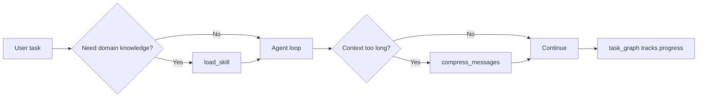

# Article 2: Stop Bloating Your System Prompt

**Phase 2 · Patterns 5–7 · ~12 min read**

[← Article 1](./01-core-agent-loop.md) · [Pattern Map](../docs/PATTERN_MAP.md) · [Next: Article 3 →](./03-multi-agent-teams.md)

---

## What you'll learn

- Why stuffing everything into the system prompt fails at scale
- How to load domain knowledge **on demand** (skills)
- How to keep long sessions within context limits (compression)
- How to persist task state outside the model's memory (task graph)

---

## The problem

Every token in your system prompt and message history counts against the model's context window. A coding agent that loads every possible instruction upfront — security rules, review checklists, style guides — pays for all of it on every turn, even when irrelevant.

Anthropic's Claude Code addresses this with **project instructions** (`CLAUDE.md`) and **skills** — knowledge loaded when needed, not baked into every request. See the [Claude Code overview](https://docs.anthropic.com/en/docs/claude-code/overview).

This phase implements three complementary strategies.

---

## Pattern 5: On-demand skill loading

**File:** `phase2_context_management/skill_loader.py`

Skills are plain-text files in `phase2_context_management/skills/`:

```
skills/
├── code_review.txt
├── security_audit.txt
└── documentation.txt
```

The model calls `load_skill(skill_name)` when it needs domain expertise. The skill content is injected into context **at that moment**, not at session start.

```python
def tool_load_skill(args: dict) -> str:
    content = load_skill(args["skill_name"])
    return f"[SKILL LOADED: {skill_name}]\n\n{content}"
```

**Benefit:** The system prompt stays lean. A security audit skill loads only when reviewing auth code, not when writing CSS.

---

## Pattern 6: Three-layer context compression

**File:** `phase2_context_management/compressor.py`

Long sessions eventually hit context limits. The compressor applies three layers:

| Layer | What it does |
|---|---|
| 1 | Summarize old conversation turns into bullet points |
| 2 | Truncate oversized tool outputs (keep head + tail) |
| 3 | Replace duplicate file-read results with delta references |

```python
messages = compress_messages(messages, client)
```

Layer 1 uses a separate API call to summarize the oldest turns. Layers 2 and 3 are pure Python — no extra API cost.

**Note:** Anthropic has not published Claude Code's exact compression strategy. This is a standard educational implementation of techniques used across production agents.

---

## Pattern 7: File-based task dependency graph

**File:** `phase2_context_management/task_graph.py`

Multi-step projects need state that survives:

- Process restarts
- Context compression
- Model attention drift

The task graph persists to `.task_graph.json`:

```python
{
  "design": {"status": "done", "depends_on": [], ...},
  "tests":  {"status": "pending", "depends_on": ["design"], ...}
}
```

Functions like `get_ready()`, `mark_done()`, and `mark_failed()` let any agent or script query what's runnable next.

**Example:** `examples/run_feature_build.py` runs four dependent tasks (design → tests → run tests → document) using this graph.

---

## How the three patterns work together



---

## Try it yourself

```bash
# Task graph demo (uses Phase 1 agent internally)
python examples/run_feature_build.py

# Inspect skills
python -c "from phase2_context_management.skill_loader import list_skills; print(list_skills())"
```

---

## Key takeaway

> Context is expensive. Load knowledge when needed, compress what ages out, and persist state on disk.

**Next:** [Article 3 — How Multi-Agent Teams Coordinate →](./03-multi-agent-teams.md)
