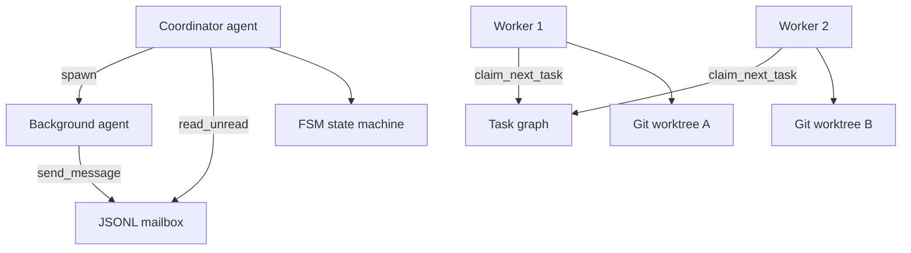

# Article 3: How Multi-Agent Teams Coordinate

**Phase 3 · Patterns 8–12 · ~15 min read**

[← Article 2](./02-knowledge-context.md) · [Pattern Map](../docs/PATTERN_MAP.md) · [Next: Article 4 →](./04-production-hardening.md)

---

## What you'll learn

- How to run subtasks without blocking the main agent
- How agents communicate asynchronously via mailboxes
- How to enforce valid task state transitions (FSM)
- How to let agents claim work without a central coordinator
- How Git worktrees isolate parallel agents on one codebase

---

## What Anthropic documents

The [Claude Code overview](https://docs.anthropic.com/en/docs/claude-code/overview) describes:

- **Agent teams** — multiple agents working on different parts of a task
- **Background agents** — long-running work you check back on later

This phase implements the **coordination primitives** those product features require: messaging, state machines, work claiming, and filesystem isolation.

---

## Pattern 8: Background tasks with notifications

**File:** `phase3_multi_agent/background_tasks.py`

Long subtasks (security audits, test runs) shouldn't block the main agent loop. Background tasks spawn a complete agent loop in a **thread** and post results to a shared queue:

```python
run_background_task("security-audit", "Check auth.py for vulnerabilities", tools, handlers)

# Main loop checks between turns:
for result in check_notifications():
    print(f"Task '{result['task_id']}' finished")
```

The master agent continues working while the background agent runs independently.

---

## Pattern 9: JSONL mailboxes

**File:** `phase3_multi_agent/mailbox.py`

Agents need persistent, async communication. Each agent has an inbox file (`.agent_mailboxes/{name}.jsonl`):

```python
send_message(to_agent="reviewer", from_agent="coordinator",
             message={"type": "review_request", "file": "auth.py"})

messages = read_unread_messages("reviewer")
```

Messages survive process restarts because they're append-only files on disk.

---

## Pattern 10: FSM communication protocol

**File:** `phase3_multi_agent/fsm_protocol.py`

Unstructured agent messages lead to invalid states ("approve" before "submit"). A finite state machine defines valid transitions:

```
CREATED → ASSIGNED → SUBMITTED → IN_REVIEW → APPROVED → DONE
                              ↘ REJECTED (back to ASSIGNED)
```

```python
fsm = AgentFSM("task-001")
fsm.transition("assign", from_agent="coordinator")   # CREATED → ASSIGNED
fsm.transition("submit", from_agent="worker")        # ASSIGNED → SUBMITTED
```

Invalid transitions raise errors — preventing coordination bugs at scale.

---

## Pattern 11: Autonomous self-assignment

**File:** `phase3_multi_agent/self_assignment.py`

Instead of a coordinator pushing tasks, agents **pull** work from the shared task graph:

```python
task = claim_next_task("agent-2", capabilities=["coding"])
```

File locking (`fcntl`) ensures two agents never claim the same task. This scales better than a central dispatcher when agent count grows.

---

## Pattern 12: Git worktree isolation

**File:** `phase3_multi_agent/worktree.py`

Two agents editing the same working directory cause file conflicts. Git worktrees give each agent its own checkout on a dedicated branch:

```python
wt_path = create_worktree("feature-auth")  # .worktrees/feature-auth/
# Agent works in wt_path — main branch untouched
cleanup_worktree("feature-auth", force=True)
```

This uses standard Git (`git worktree add`), not Anthropic-specific technology.

---

## End-to-end example

**File:** `examples/run_code_review.py`

Demonstrates Phases 1–3 together:

1. A coordinator agent receives a review request
2. A background reviewer agent reads the file
3. Findings are sent via JSONL mailbox
4. The coordinator summarizes when notified

```bash
python examples/run_code_review.py path/to/file.py
```

**File:** `examples/run_refactor.py`

Demonstrates Patterns 11–12: two agents claim parallel refactor tasks in isolated worktrees.

---

## Coordination stack



---

## Key takeaway

> Multi-agent systems fail on coordination, not intelligence. Mailboxes, state machines, and isolation are the hard parts.

**Next:** [Article 4 — From Prototype to Production →](./04-production-hardening.md)
