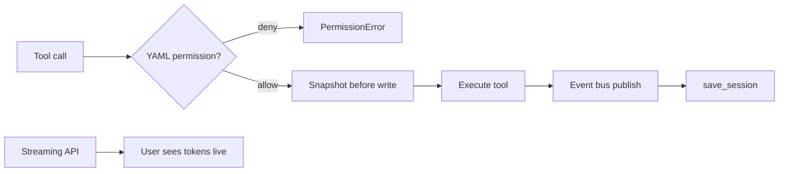

# Article 4: From Prototype to Production

**Phase 4 · Patterns 13–17 · ~12 min read**

[← Article 3](./03-multi-agent-teams.md) · [Pattern Map](../docs/PATTERN_MAP.md) · [Next: Article 5 →](./05-async-performance.md)

---

## What you'll learn

- Streaming model output for real-time visibility
- Reversible file writes via automatic snapshots
- Declarative tool permissions in YAML
- Lifecycle hooks via an event bus
- Session persistence, resume, and fork

---

## Why Phase 4 exists

Phases 1–3 give you a capable agent. Phase 4 makes it **safe to run on real code**:

- Mistakes are undoable
- Dangerous operations are blocked by policy
- Every action is observable
- Sessions survive crashes

Anthropic documents related concepts in [Claude Code hooks](https://docs.anthropic.com/en/docs/claude-code/hooks) and [settings/permissions](https://docs.anthropic.com/en/docs/claude-code/settings). This repo implements analogous harness patterns in Python.

---

## Pattern 13: Real-time streaming

**File:** `phase4_production/streaming_agent.py`

Users shouldn't stare at a blank terminal for 30 seconds. Streaming prints tokens as they arrive:

```python
with client.messages.stream(model=MODEL, messages=messages) as stream:
    for text in stream.text_stream:
        print(text, end="", flush=True)
```

**Public reference:** [Streaming Messages](https://docs.anthropic.com/en/docs/build-with-claude/streaming)

---

## Pattern 14: File snapshots

**File:** `phase4_production/snapshots.py`

Every write is preceded by an automatic backup to `.file_snapshots/`:

```python
def tool_safe_write(args):
    snapshot_before_write(args["path"])
    Path(args["path"]).write_text(args["content"])
```

`revert_file(path)` restores the most recent snapshot. Agents can make bold edits knowing nothing is permanent until you say so.

---

## Pattern 15: YAML-governed permissions

**File:** `phase4_production/permissions.py` + `permissions.yaml`

Tool calls are checked against declarative rules before execution:

```yaml
rules:
  - tool: run_shell
    command_pattern: "rm|del"
    path_pattern: ".*(prod|production).*"
    action: deny
    reason: "No destructive commands in production paths"
```

Change policy by editing YAML — no Python changes required. This mirrors Claude Code's [permission rules syntax](https://docs.anthropic.com/en/docs/claude-code/settings).

```python
allowed, reason = check_permission(tool_name, tool_args)
if not allowed:
    raise PermissionError(reason)
```

---

## Pattern 16: Event bus

**File:** `phase4_production/event_bus.py`

Logging, metrics, and alerts shouldn't be woven into every tool handler. The event bus publishes lifecycle events:

```python
subscribe("before_call", log_all_calls)
subscribe("after_call",  audit_writes)
subscribe("error",       alert_on_failure)
```

Anthropic's [hooks system](https://docs.anthropic.com/en/docs/claude-code/hooks) fires at similar lifecycle points (`PreToolUse`, `PostToolUse`, `PermissionRequest`). The event bus is the in-process equivalent for this educational harness.

---

## Pattern 17: Session persistence

**File:** `phase4_production/session_store.py`

Agent state (full message history) is saved after every turn to `.sessions/`:

```python
save_session("task-design", messages)
state = load_session("task-design")       # resume
fork  = fork_session("task-design", "task-design-v2")  # branch
```

If the process crashes mid-task, reload the session and continue from the last saved turn.

---

## Production stack diagram



---

## Try it yourself

```bash
python phase4_production/streaming_agent.py "Explain what a snapshot is."

# Inspect permissions
python -c "
from phase4_production.permissions import check_permission
print(check_permission('run_shell', {'command': 'rm -rf /prod/data'}))
"
```

---

## Key takeaway

> Production agents need undo, policy, observability, and persistence — not just intelligence.

**Next:** [Article 5 — Async Performance and MCP →](./05-async-performance.md)
