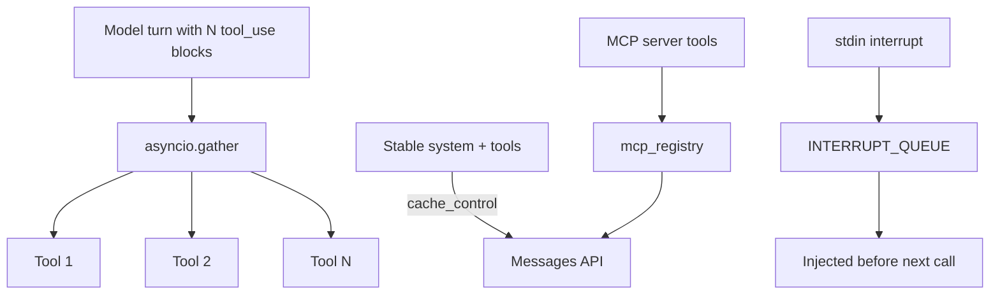

# Article 5: Async Performance, Caching, and MCP

**Phase 5 · Patterns 18–21 · ~12 min read**

[← Article 4](./04-production-hardening.md) · [Pattern Map](../docs/PATTERN_MAP.md) · [Next: Article 6 →](./06-enterprise.md)

---

## What you'll learn

- Running multiple tool calls from one model turn in parallel
- Injecting user interrupts into a running agent
- Reducing cost with Anthropic's prompt caching API
- Extending tools via the Model Context Protocol (MCP)

---

## Pattern 18: Parallel tool execution

**File:** `phase5_async_runtime/async_agent.py`

When the model requests five file reads in one turn, running them sequentially wastes time:

```
Sequential: 5 reads × 200ms = 1000ms
Parallel:   max(200ms)      = 200ms
```

```python
tool_results = await asyncio.gather(
    *[execute_tool(block) for block in tool_blocks]
)
```

The agent loop uses `AsyncAnthropic` and `aiofiles` for non-blocking I/O. The model still makes one API call per turn — parallelism is a **harness optimization**, not an API feature.

```bash
python phase5_async_runtime/async_agent.py
```

---

## Pattern 19: Interrupt injection

**File:** `phase5_async_runtime/interrupt.py`

Users need to redirect a running agent without killing the session:

```python
inject_interrupt("Stop — use pytest instead of unittest")
```

A background stdin listener queues interrupts. Before each model call, queued messages are injected as user turns:

```python
while not INTERRUPT_QUEUE.empty():
    messages.append({"role": "user", "content": f"[INTERRUPT] {msg}"})
```

This is a harness pattern for interactive control — not documented as a specific Claude Code API.

---

## Pattern 20: Prompt caching

**File:** `phase5_async_runtime/caching.py`

System prompts and tool schemas are **identical across turns**. Anthropic's [prompt caching](https://docs.anthropic.com/en/docs/build-with-claude/prompt-caching) lets you mark stable blocks with `cache_control`:

```python
system=[{
    "type": "text",
    "text": SYSTEM_PROMPT,
    "cache_control": {"type": "ephemeral"},
}]
```

On subsequent turns, cached input tokens cost less. Inspect savings via `response.usage.cache_read_input_tokens`.

**Important:** Actual savings depend on your workload, model, and cache hit rate. This repo shows *how* to enable caching — it does not guarantee a specific percentage.

```bash
python phase5_async_runtime/caching.py
```

---

## Pattern 21: MCP tool registry

**File:** `phase5_async_runtime/mcp_registry.py`

The [Model Context Protocol](https://modelcontextprotocol.io) is an open standard for connecting AI tools to external data sources. Claude Code supports MCP — see [Claude Code MCP docs](https://docs.anthropic.com/en/docs/claude-code/mcp).

This educational implementation loads pre-exported tool schemas from `.mcp_servers/`:

```python
schemas, handlers = merge_tool_sets(
    native_schemas, native_handlers,
    mcp_server="example", mcp_handlers={...},
)
```

In production, schemas come from the MCP handshake (`tools/list`). Here, `register_example_server()` writes a sample export for local experimentation.

```bash
python phase5_async_runtime/mcp_registry.py
```

---

## Performance layer diagram



---

## Key takeaway

> Speed comes from parallel I/O. Cost comes from caching stable context. Reach comes from MCP.

**Next:** [Article 6 — Enterprise-Grade Agent Fleets →](./06-enterprise.md)
