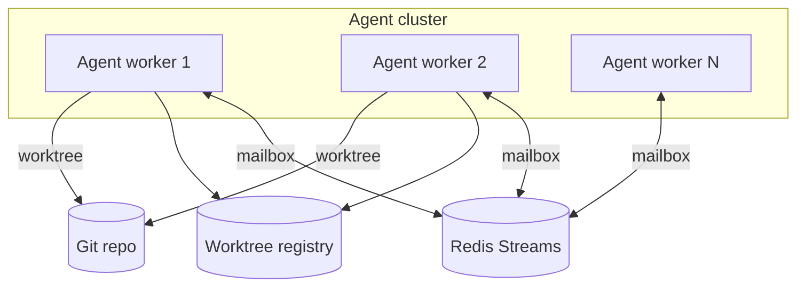

# Article 6: Enterprise-Grade Agent Fleets

**Phase 6 · Patterns 22–23 · ~10 min read**

[← Article 5](./05-async-performance.md) · [Pattern Map](../docs/PATTERN_MAP.md) · [Back to README](../README.md)

---

## What you'll learn

- Replacing local file mailboxes with Redis Streams for distributed agents
- Managing Git worktree lifecycles at scale (create, merge, prune)
- Wiring all 23 patterns together in one entry point

---

## When Phase 6 matters

Phases 1–5 run on a single machine. Enterprise deployments need:

- Agents on **multiple servers** sharing one message broker
- **Automatic cleanup** of hundreds of parallel Git branches
- A reference architecture that combines every prior pattern

Anthropic operates Claude Code at scale internally, but has not published its infrastructure details. Patterns 22–23 are standard distributed-systems engineering applied to agent coordination.

---

## Pattern 22: Redis Streams mailboxes

**File:** `phase6_enterprise/redis_mailbox.py`

JSONL mailboxes (Pattern 9) work on one machine. Redis Streams enable cross-server messaging:

```python
await mailbox.send(to_agent="reviewer", from_agent="coordinator",
                   message={"type": "review_request", "file": "auth.py"})

async for msg_id, envelope in mailbox.receive("reviewer", "worker-1"):
    await process_review(envelope)
    await mailbox.acknowledge("reviewer", msg_id)
```

**Why Redis Streams over JSONL:**

| Property | JSONL files | Redis Streams |
|---|---|---|
| Cross-machine | No | Yes |
| Delivery | Poll-based | Push via consumer groups |
| Durability | Filesystem | Redis persistence |
| Exactly-once | Manual | Consumer group ACK |

**Requires:** Redis 7+ running locally or via Docker:

```bash
docker run -p 6379:6379 redis
python phase6_enterprise/redis_mailbox.py
```

---

## Pattern 23: Worktree lifecycle management

**File:** `phase6_enterprise/worktree_lifecycle.py`

Pattern 12 creates worktrees. Pattern 23 **manages their full lifecycle**:

```python
manager = WorktreeLifecycleManager()
manager.create("task-001", agent_name="agent-1")
manager.mark_idle("task-001")           # task done, awaiting merge
manager.merge("task-001")               # merge to main if no conflicts
manager.prune_stale(max_idle_hours=24)  # auto-cleanup abandoned worktrees
```

A registry file (`.worktree_registry.json`) tracks every worktree's status: `ACTIVE`, `IDLE`, `MERGED`, `ABANDONED`, `CONFLICT`.

At scale — dozens of parallel agents — without lifecycle management, stale branches and orphaned directories accumulate fast.

---

## All 23 patterns combined

**File:** `phase6_enterprise/combined_agent.py`

The reference entry point wires Phases 1–5 into a multi-agent demo:

1. **Event bus** — observability subscribers
2. **Task graph** — four dependent demo tasks
3. **Self-assignment** — two worker threads claim tasks
4. **Permissions + snapshots** — governed, reversible writes
5. **Session store** — state saved after each task

```bash
export ANTHROPIC_API_KEY=your-key
python phase6_enterprise/combined_agent.py
```

---

## Enterprise architecture



---

## Full curriculum map

| Phase | Patterns | Article |
|---|---|---|
| 1 | 1–4 | [Core agent loop](./01-core-agent-loop.md) |
| 2 | 5–7 | [Knowledge & context](./02-knowledge-context.md) |
| 3 | 8–12 | [Multi-agent teams](./03-multi-agent-teams.md) |
| 4 | 13–17 | [Production hardening](./04-production-hardening.md) |
| 5 | 18–21 | [Async & MCP](./05-async-performance.md) |
| 6 | 22–23 | This article |

See also: [Pattern Map](../docs/PATTERN_MAP.md) for code paths and Anthropic doc links.

---

## Key takeaway

> Single-machine agents are prototypes. Redis, lifecycle management, and composed patterns are what make agent fleets operable.

You now have all 23 patterns — each in its own file, each runnable, each mapped to public documentation where it exists.

**Start over:** [Article 1 — The Core Agent Loop →](./01-core-agent-loop.md)
