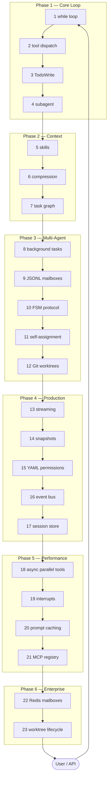
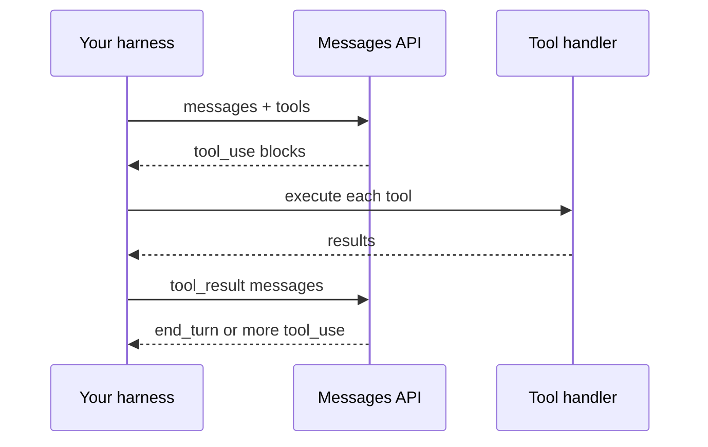

# Pattern Map: 23 Patterns → Code → Public Documentation

This page maps every pattern in this repository to its implementation file and, where one exists, the closest **public** Anthropic or MCP documentation. Patterns without a doc link are standard agent-engineering techniques not uniquely documented by Anthropic.

> **Scope:** This is an educational reimplementation. Anthropic has not published Claude Code's internal source code. Doc links describe *related public concepts*, not a claim that Claude Code is implemented exactly this way.

---

## Architecture Overview

---

## Agent Loop (Anthropic-documented)

Anthropic describes client-side tool use as an **agentic loop**: the model returns `stop_reason: "tool_use"`, your application executes the tool, you send back a `tool_result`, and the model continues.

**Public reference:** [Tool use with Claude](https://docs.anthropic.com/en/docs/agents-and-tools/tool-use/overview)

**This repo:** `phase1_core_loop/agent.py` (Patterns 1–2)

---

## Full Pattern Table

| # | Pattern | Implementation | Public documentation | Relationship |
|---|---|---|---|---|
| 1 | Minimal while loop | [`phase1_core_loop/agent.py`](../phase1_core_loop/agent.py) | [Tool use overview](https://docs.anthropic.com/en/docs/agents-and-tools/tool-use/overview) | Implements the client-side agentic loop Anthropic describes |
| 2 | Tool dispatch map | [`phase1_core_loop/tools.py`](../phase1_core_loop/tools.py) | [Tool use overview](https://docs.anthropic.com/en/docs/agents-and-tools/tool-use/overview) | Routes `tool_use` blocks to handler functions |
| 3 | TodoWrite planning | [`phase1_core_loop/todo_tools.py`](../phase1_core_loop/todo_tools.py) | — | Common agent planning pattern; not Anthropic-specific |
| 4 | Subagent isolation | [`phase1_core_loop/subagent.py`](../phase1_core_loop/subagent.py) | [Claude Code overview — agent teams](https://docs.anthropic.com/en/docs/claude-code/overview) | Related to documented multi-agent / delegation features |
| 5 | On-demand skill loading | [`phase2_context_management/skill_loader.py`](../phase2_context_management/skill_loader.py) | [Claude Code overview — skills & CLAUDE.md](https://docs.anthropic.com/en/docs/claude-code/overview) | Mirrors loading domain knowledge on demand |
| 6 | Context compression | [`phase2_context_management/compressor.py`](../phase2_context_management/compressor.py) | — | Standard technique for long-context sessions |
| 7 | Task dependency graph | [`phase2_context_management/task_graph.py`](../phase2_context_management/task_graph.py) | — | File-based orchestration; related to workflow concepts |
| 8 | Background tasks | [`phase3_multi_agent/background_tasks.py`](../phase3_multi_agent/background_tasks.py) | [Claude Code overview — background agents](https://docs.anthropic.com/en/docs/claude-code/overview) | Non-blocking subtask execution |
| 9 | JSONL mailboxes | [`phase3_multi_agent/mailbox.py`](../phase3_multi_agent/mailbox.py) | — | Local-file inter-agent messaging |
| 10 | FSM protocol | [`phase3_multi_agent/fsm_protocol.py`](../phase3_multi_agent/fsm_protocol.py) | — | Structured task state transitions |
| 11 | Self-assignment | [`phase3_multi_agent/self_assignment.py`](../phase3_multi_agent/self_assignment.py) | [Claude Code overview — agent teams](https://docs.anthropic.com/en/docs/claude-code/overview) | Pull-based work claiming |
| 12 | Git worktree isolation | [`phase3_multi_agent/worktree.py`](../phase3_multi_agent/worktree.py) | — | Git feature; used for parallel agent isolation |
| 13 | Real-time streaming | [`phase4_production/streaming_agent.py`](../phase4_production/streaming_agent.py) | [Streaming Messages](https://docs.anthropic.com/en/docs/build-with-claude/streaming) | Uses `client.messages.stream()` |
| 14 | File snapshots | [`phase4_production/snapshots.py`](../phase4_production/snapshots.py) | — | Reversible writes for safety |
| 15 | YAML permissions | [`phase4_production/permissions.py`](../phase4_production/permissions.py) | [Claude Code settings — permissions](https://docs.anthropic.com/en/docs/claude-code/settings) | Declarative policy; analogous to permission rules |
| 16 | Event bus | [`phase4_production/event_bus.py`](../phase4_production/event_bus.py) | [Hooks reference](https://docs.anthropic.com/en/docs/claude-code/hooks) | Similar lifecycle interception concept |
| 17 | Session persistence | [`phase4_production/session_store.py`](../phase4_production/session_store.py) | [Claude Code overview — session continuity](https://docs.anthropic.com/en/docs/claude-code/overview) | Save/resume message history |
| 18 | Parallel tool execution | [`phase5_async_runtime/async_agent.py`](../phase5_async_runtime/async_agent.py) | — | Harness optimization; API still one call per turn |
| 19 | Interrupt injection | [`phase5_async_runtime/interrupt.py`](../phase5_async_runtime/interrupt.py) | — | Mid-run user redirection |
| 20 | Prompt caching | [`phase5_async_runtime/caching.py`](../phase5_async_runtime/caching.py) | [Prompt caching](https://docs.anthropic.com/en/docs/build-with-claude/prompt-caching) | Uses `cache_control` breakpoints |
| 21 | MCP integration | [`phase5_async_runtime/mcp_registry.py`](../phase5_async_runtime/mcp_registry.py) | [Claude Code MCP](https://docs.anthropic.com/en/docs/claude-code/mcp), [MCP spec](https://modelcontextprotocol.io) | External tool discovery |
| 22 | Redis mailboxes | [`phase6_enterprise/redis_mailbox.py`](../phase6_enterprise/redis_mailbox.py) | — | Distributed replacement for Pattern 9 |
| 23 | Worktree lifecycle | [`phase6_enterprise/worktree_lifecycle.py`](../phase6_enterprise/worktree_lifecycle.py) | — | Automated create/merge/prune at scale |

---

## Phase → Article → Example

| Phase | Article | Runnable example |
|---|---|---|
| 1 | [Article 1](../articles/01-core-agent-loop.md) | `python phase1_core_loop/agent.py` |
| 2 | [Article 2](../articles/02-knowledge-context.md) | `python examples/run_feature_build.py` |
| 3 | [Article 3](../articles/03-multi-agent-teams.md) | `python examples/run_code_review.py` |
| 4 | [Article 4](../articles/04-production-hardening.md) | `python phase4_production/streaming_agent.py` |
| 5 | [Article 5](../articles/05-async-performance.md) | `python phase5_async_runtime/async_agent.py` |
| 6 | [Article 6](../articles/06-enterprise.md) | `python phase6_enterprise/combined_agent.py` |

---

## Official Anthropic Resources (verified URLs)

| Topic | URL |
|---|---|
| Claude Code product overview | https://docs.anthropic.com/en/docs/claude-code/overview |
| Tool use / agentic loop | https://docs.anthropic.com/en/docs/agents-and-tools/tool-use/overview |
| Messages API | https://docs.anthropic.com/en/api/messages |
| Streaming | https://docs.anthropic.com/en/docs/build-with-claude/streaming |
| Prompt caching | https://docs.anthropic.com/en/docs/build-with-claude/prompt-caching |
| Claude Code MCP | https://docs.anthropic.com/en/docs/claude-code/mcp |
| Claude Code hooks | https://docs.anthropic.com/en/docs/claude-code/hooks |
| Claude Code settings / permissions | https://docs.anthropic.com/en/docs/claude-code/settings |
| Model Context Protocol | https://modelcontextprotocol.io |

---

## Corrections Welcome

If a link breaks or a mapping overstates what Anthropic documents, please [open an issue](https://github.com/dhsoni2510/claude-code-architecture/issues) with the corrected public source.
